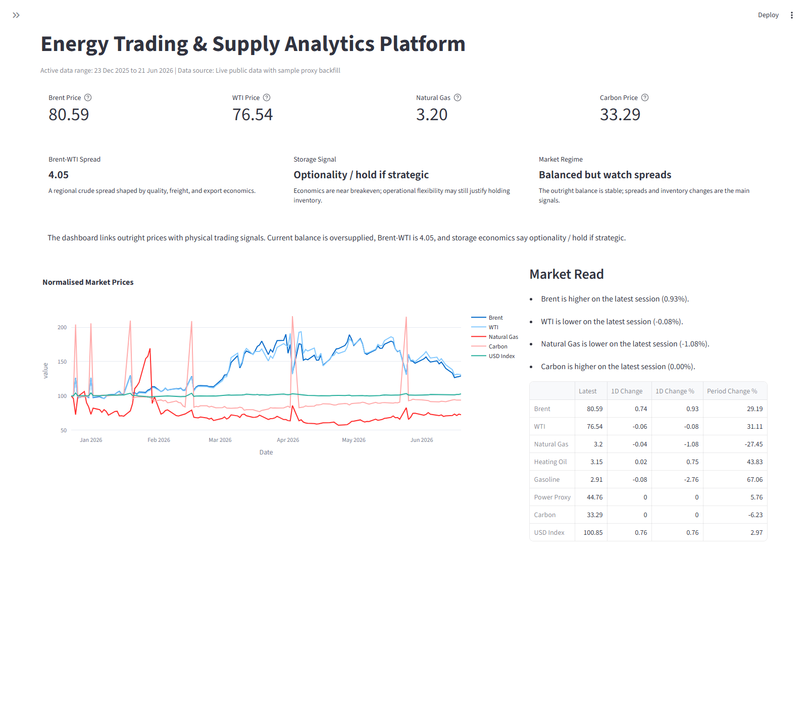
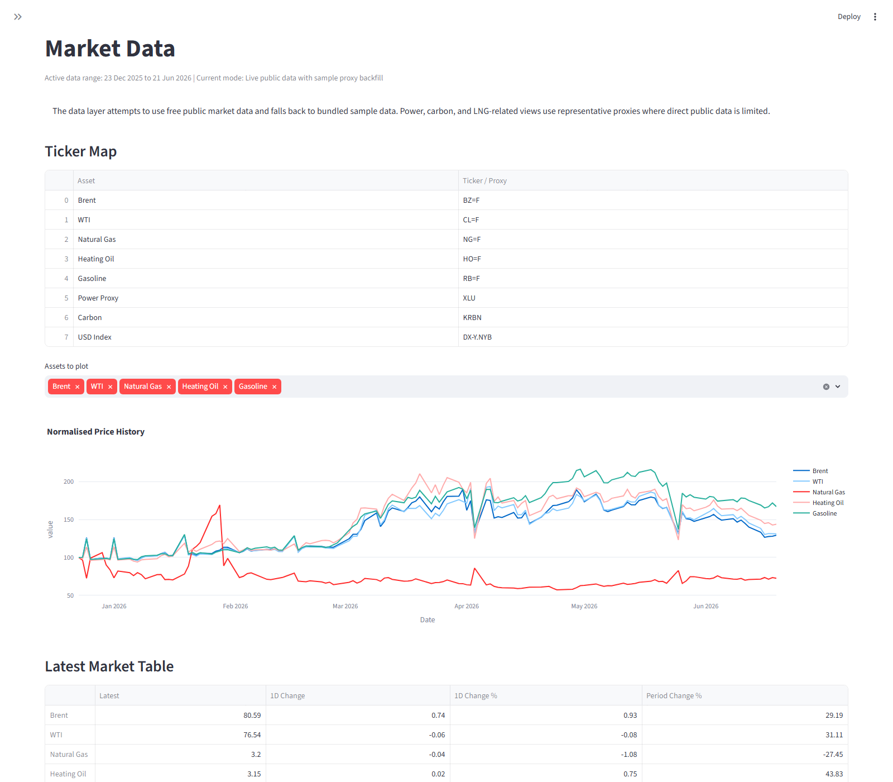
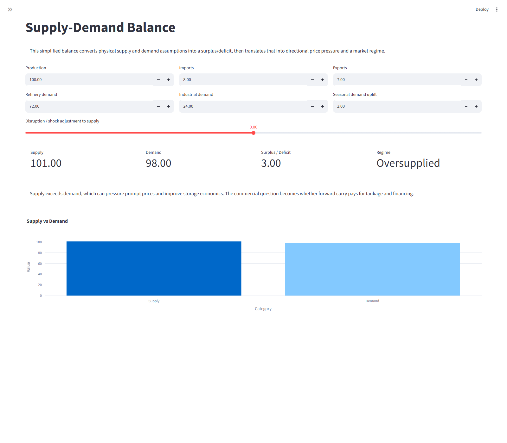
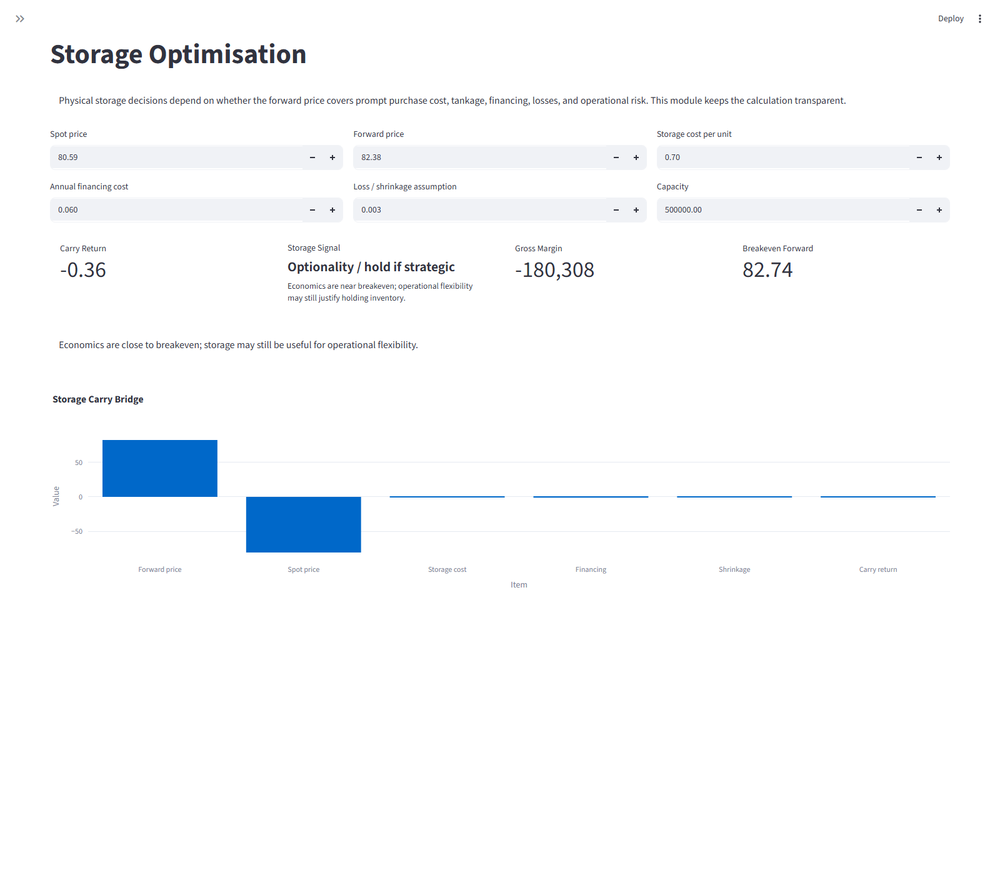
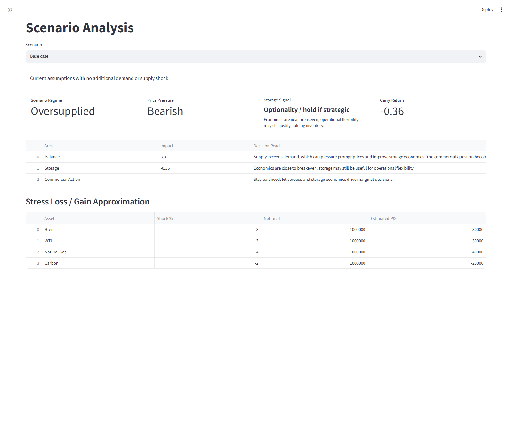
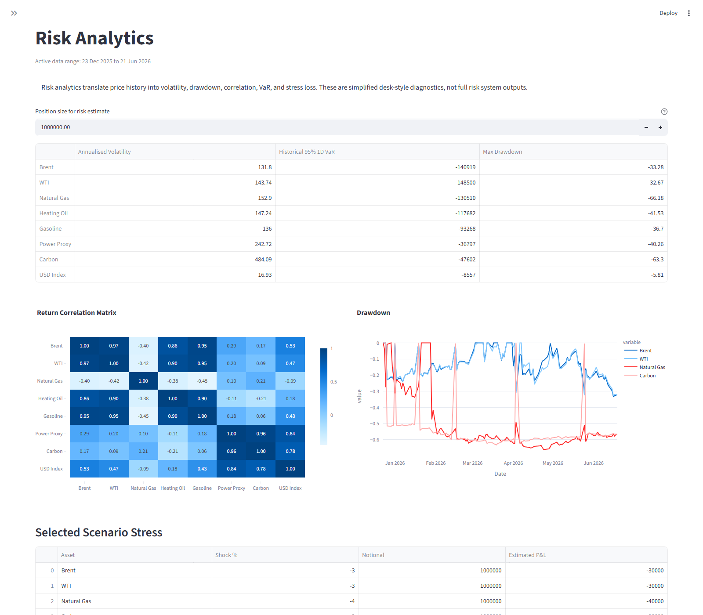
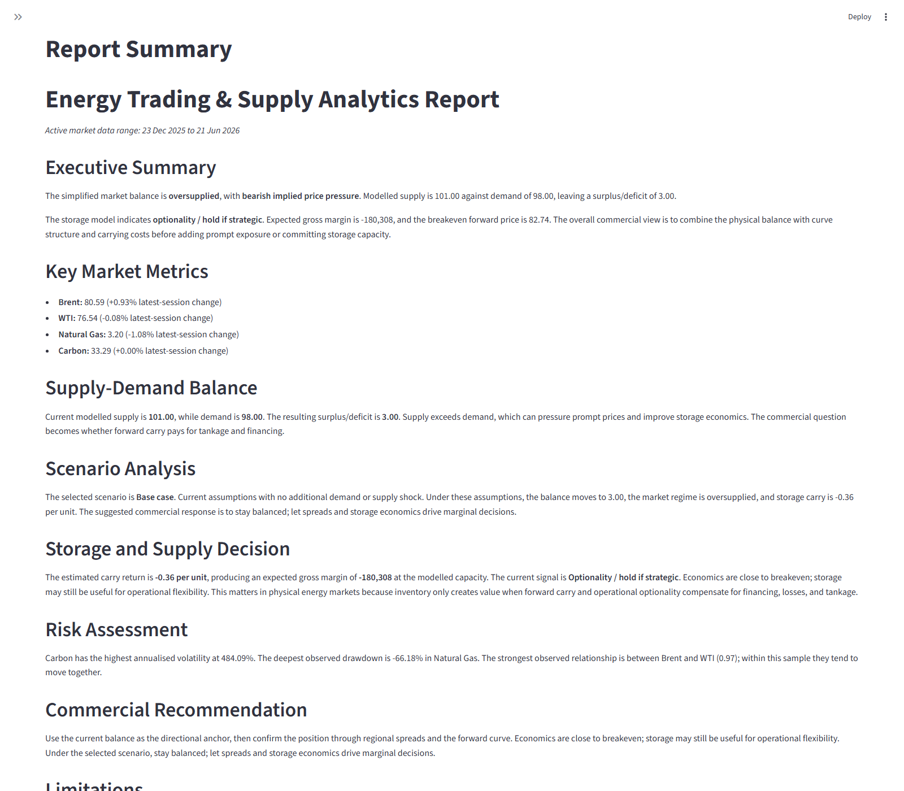

# Energy Trading & Supply Analytics Platform

A Streamlit-based commodity trading and supply analytics project for energy markets, focused on crude oil, natural gas, storage economics, supply-demand balances, risk analytics, scenario analysis, and analyst-style market notes.

This personal research project explores energy trading, physical supply chains, commodity spreads, storage decisions, and market risk through a clean Streamlit interface. It brings together Python, public market data, transparent modelling, scenario analysis, and commercial decision-making.

## Modules

- **Dashboard** - high-level market cards, price charts, storage signal, market regime, and concise interpretation.
- **Market Data** - public/free ticker loading where available, ticker/proxy map, latest market table, and offline fallback sample data.
- **Supply-Demand Balance** - editable simplified model for production, trade flows, demand, seasonality, and disruption shocks.
- **Storage Optimisation** - physical storage carry economics, gross margin, breakeven forward price, and store/sell signal.
- **Spread Analysis** - Brent-WTI spread, crude vs gas comparison, product spread proxy, and sample forward curve structure.
- **Scenario Analysis** - base case, cold winter, supply disruption, recession, LNG import surge, and carbon shock scenarios.
- **Risk Analytics** - daily returns, volatility, drawdown, correlation matrix, simple historical VaR, and stress loss.
- **Trading & Supply Assistant** - deterministic market-note generator with market context, major risks, and commercial recommendations.
- **Report Summary** - analyst-style report with executive summary, metrics, scenario result, recommendation, and limitations.

## Quick Start

### Windows PowerShell

```powershell
python -m venv .venv
.\.venv\Scripts\Activate.ps1
pip install -r requirements.txt
streamlit run app.py
```

### macOS/Linux

```bash
python -m venv .venv
source .venv/bin/activate
pip install -r requirements.txt
streamlit run app.py
```

## Data Notes and Limitations

- Uses public/free market data where available.
- Includes fallback sample data for demonstration.
- Forward curves and supply-demand inputs are simplified.
- The platform is educational and not trading advice.
- Storage economics are simplified and exclude many real-world constraints.
- Power/LNG/carbon proxies may use representative tickers or sample data depending on data availability.

Public ticker proxies are useful for demonstration, but they do not replace exchange-grade data, broker curves, physical nominations, freight data, refinery economics, or proprietary supply-demand balances.

## Screenshots

### Dashboard Overview



### Market Data



### Supply-Demand Balance



### Storage Optimisation



### Scenario Analysis



### Risk Analytics



### Report Summary



## Future Improvements

- Add proper exchange/API commodity data.
- Add real forward curve ingestion.
- Add physical logistics constraints.
- Add refinery margin/crack spread modelling.
- Add LNG shipping and regasification assumptions.
- Add Monte Carlo scenario simulation.
- Add PowerPoint/PDF report export.
- Add saved cases by commodity and region.

## Project Structure

```text
./
  app.py
  requirements.txt
  README.md
  data/
    sample_market_data.csv
    sample_forward_curves.csv
  src/
    data_loader.py
    market_data.py
    supply_demand.py
    storage.py
    spreads.py
    scenarios.py
    risk.py
    report.py
    assistant.py
    ui.py
  screenshots/
    dashboard.png
    market_data.png
    supply_demand.png
    storage_optimisation.png
    scenario_analysis.png
    risk_analytics.png
    report_summary.png
```
